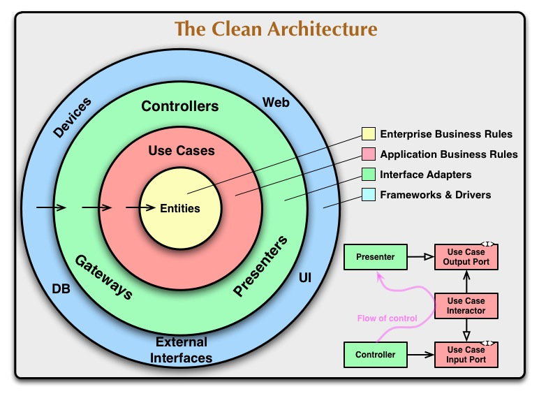
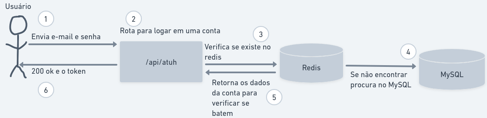

# KFinances

## Ferramentas utilizadas


## Sobre

Um projeto feito para você anotar as suas despesas, lembra aquela fatura do cartão que você sempre esquece ou acha que não pagou? simples salve ela no sistema logo após pagar, atualize ela, quando precisar saber se já pagou basta olhar as suas despesas pendente

- Porquê decidiu fazer esse projeto?
  - Para aplicar o que eu estudava, aprender novas coisas e aplicar elas também em um projeto prático

- Quais foram os desafios de implementá-lo?
  - Seguir um padrão de testes, configurar o spring security e otimizar o hibernate / spring data jpa

- O que eu aprendi com ele?
  - Padrões de teste, como configurar e executar os testes com perfil especifíco, otimizar o hibernate, métricas com micrometer e prometheus, spring security e tratar os erros lançado e cache com spring data

## Tabela de conteúdos

- [Arquitetura](#arquitetura)
- [Features](#features)
- [Instruções para executar o projeto](#instruções-para-executar-o-projeto)
- [Contribua com o projeto](#contribuindo-com-o-projeto)
- [Changelog](#changelog)

## Arquitetura



**Camadas da aplicação**

*Domain, é a camada onde se encontra as regras de negócio, validações e as interfaces gateways (abstração dos métodos do banco dedados, são usadas para remover o acomplamento com o banco de dados)*

*Application, é a camada que contem todos os casos de uso (criar um usuário, pegar um usuário pelo id, atualizar um usuário, deletar um usuário, esse é famoso CRUD) e contem a integração com o gateway do banco de dados*

*Infrastructure, é a camada responsável por conectar tudo, o usuário com a application e domain layer, contem a conexão com o banco de dados, entidades do banco e as rotas*

## Features

Principais rotas e features do sistema

1. Criação de uma conta na aplicação:


<br>

2. Logar em uma conta já cadastrada na aplicação:


<br>

3. Criar uma despesa para a sua conta:


## Instruções para executar o projeto

1. Baixe a aplicação e instale as dependências:
```bash
# Baixando o projeto e acessando o diretorio
git clone https://github.com/Kaua3045/kfinances.git cd kfinances

# Baixando as dependências
./gradlew --refresh-dependencies  
```

2. Suba o container da aplicação e suas dependências:
```bash
# Cria a imagem da aplicação e sobe os containers
docker-compose up --build -d
```

3. Para acessar a api, basta usar a url: *localhost:8080/api*
4. Para acessar o grafana com as métricas, basta usar a url: *localhost:3333*

## Contribuindo com o projeto

Para contribuir com o projeto, veja mais informações em [CONTRIBUTING](doc/CONTRIBUTING.md)

## Changelog

Para ver as últimas alterações do projeto, acesse [AQUI](doc/changelog.md)